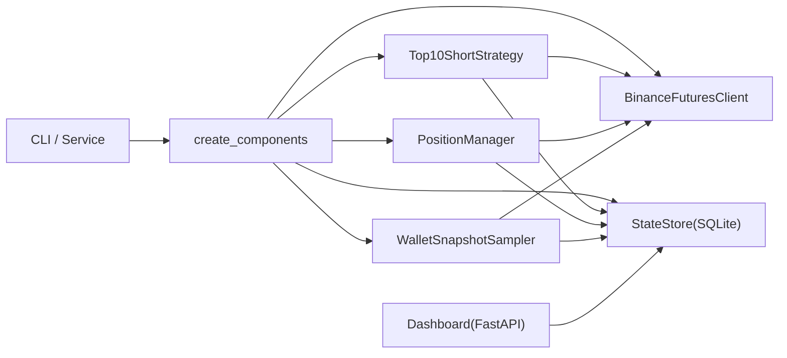

# Bubble Buster

币安 U 本位合约策略项目，核心是：
- 每日固定时间做一次 Top N 涨幅做空入场；
- 持仓巡检（止盈/止损/超时/动态止损）；
- 每日定时浮亏砍仓；
- 本地 Dashboard 可视化；
- SQLite 落库，便于回放和排障。

---

## 1) 项目分析（基于当前代码）

### 核心入口与职责

- `main.py`
  - CLI 主入口，支持 `entry / manage / loss-cut / service / dashboard`。
  - 启动前做文件锁，防止重复执行。
- `core/runtime_components.py`
  - 统一装配 `BinanceFuturesClient / StateStore / Strategy / PositionManager / WalletSnapshotSampler`。
- `core/runtime_service.py`
  - 内置调度器（替代 cron），按时驱动 `entry + daily loss-cut + manage`。
- `core/strategy_top10_short.py`
  - 日内入场主逻辑（TopN 选币、按余额分配、做空、挂 TP/SL、失败缩量重试、风险兜底平仓）。
- `core/position_manager.py`
  - 持仓巡检与管理（TP/SL 成交处理、超时平仓、动态止损、每日浮亏砍仓）。
  - 浮亏砍仓支持两种范围：
    - `tracked`：只处理策略数据库中 OPEN 仓位；
    - `exchange`：扫描交易所账户当前全部持仓并对浮亏仓位平仓。
- `core/balance_sampler.py`
  - 采集权益快照（钱包余额 + 持仓未实现盈亏），可选同步现金流（如 TRANSFER）。
- `dashboard_fastapi.py` + `dashboard_server.py`
  - Dashboard API 与前端页面渲染。
  - 支持策略权益曲线、账户权益曲线、回撤统计、仓位/事件/日志。
- `infra/binance_futures_client.py`
  - 交易 API 封装（签名、重试、规则归一化、条件单 fallback）。
- `core/state_store.py` + `schema.sql`
  - 状态持久化（runs/positions/order_events/wallet_snapshots/cashflow_events/locks）。

### 当前实现特点（重要）

- 幂等：`entry` 按 `trade_day_utc` 防重。
- 风控兜底：
  - 入场后挂 TP/SL 失败会触发风险平仓；
  - 止损条件单不支持时会降级到 `reduceOnly`。
- 调度容错：
  - `entry` 有 grace 与 catch-up 选项；
  - `manage` 有 catch-up 上限，避免补跑风暴；
  - `service` 内置的 daily loss-cut 是严格 1 分钟窗口，错过当天跳过。
- 可运维性：
  - `log_dir/db_path/lock_file` 可配置，支持多实例隔离（比如账户 A、B）。

---

## 2) 执行流（简图）



---

## 3) 运行前准备

```bash
PROJECT_DIR=/root/bubble_buster
cd "$PROJECT_DIR"
python3 -m pip install -r requirements.txt
cp config.ini.example config.ini
```

至少填写：
- `[binance]` `api_key` / `api_secret`
- `[notify]` `enabled` / `serverchan_sendkey`（可选）

---

## 4) 运行方式

### A. 内置调度服务（推荐单进程）

```bash
cd /root/bubble_buster
python3 main.py service --config /root/bubble_buster/config.ini
```

会自动执行：
- 定时 `entry`
- 定时 `daily loss-cut`
- 周期 `manage`
- 周期余额快照

### B. Dashboard（FastAPI）

方式 1（推荐）：
```bash
cd /root/bubble_buster
python3 main.py dashboard --config /root/bubble_buster/config.ini --host 0.0.0.0 --port 8787
```

方式 2（等价）：
```bash
cd /root/bubble_buster
BUBBLE_BUSTER_CONFIG=/root/bubble_buster/config.ini \
uvicorn app.main:app --host 0.0.0.0 --port 8787
```

### C. 单次命令

```bash
cd /root/bubble_buster

# 单次入场
python3 main.py entry --config /root/bubble_buster/config.ini

# 单次巡检
python3 main.py manage --config /root/bubble_buster/config.ini

# 巡检循环
python3 main.py manage --config /root/bubble_buster/config.ini --loop

# 单次浮亏砍仓
python3 main.py loss-cut --config /root/bubble_buster/config.ini
```

---

## 5) 账户 A / B 隔离最佳实践

### 目标

- 账户 A：保持现有自动化交易（例如 systemd 跑 `service`）。
- 账户 B：只做“每天北京时间 11:55 浮亏砍仓”。

### 配置隔离（必须）

账户 B 使用单独配置：`config_b.ini`（项目已提供模板）。

关键项：
- `daily_loss_cut_enabled = true`
- `daily_loss_cut_hour = 11`
- `daily_loss_cut_minute = 55`
- `daily_loss_cut_scope = exchange`
- `lock_file = runtime_b.lock`
- `db_path = state_b.db`
- `log_dir = logs_b`

### cron（账户 B 专用）

```cron
CRON_TZ=Asia/Shanghai
55 11 * * * /usr/bin/python3 /root/bubble_buster/main.py loss-cut --config /root/bubble_buster/config_b.ini
```

说明：
- 这条任务只跑 `loss-cut`，不会触发 `entry/manage/service`。
- `loss-cut` 下单使用 `reduceOnly`，不会开新仓。

---

## 6) 关键配置说明

### `[strategy]`

- `top_n`：入场目标币种数。
- `allocation_splits`：余额切分份数（每份作为基准保证金）。
- `entry_fee_buffer_pct`：入场前预留手续费缓冲。
- `entry_shrink_retry_count` / `entry_shrink_step_pct`：保证金不足时缩量重试。
- `tp_price_drop_pct`：止盈触发跌幅（做空方向）。
- `sl_liq_buffer_pct`：止损参考清算价缓冲。
- `max_hold_hours`：超时平仓阈值。

### `[runtime]`

- `timezone`：调度时区（建议 `Asia/Shanghai`）。
- `entry_hour` / `entry_minute`：入场时间。
- `entry_misfire_grace_min`：entry 允许补跑窗口。
- `entry_catchup_enabled`：错过是否补跑。
- `daily_loss_cut_enabled` / `daily_loss_cut_hour` / `daily_loss_cut_minute`：每日浮亏砍仓开关与时间。
- `daily_loss_cut_scope`：
  - `tracked`：只看策略跟踪仓位；
  - `exchange`：看账户全仓位（账户 B 建议）。
- `manager_interval_sec` / `manager_max_catch_up_runs`：巡检周期与补跑上限。
- `run_service_with_dashboard`：
  - `true`：Dashboard 启动时同时拉起后台服务；
  - `false`：Dashboard 只做展示（适合你已有 systemd 服务时）。
- `db_path` / `log_dir` / `lock_file`：实例隔离关键参数。

### `[notify]`

- `enabled`：是否发送通知。
- `serverchan_sendkey`：Server 酱 Key。

### `[Settings]`（兼容旧脚本）

- 由 `infra/binance_top10_monitor.py` 的兼容逻辑读取，主流程不依赖它。

---

## 7) 数据库表

- `runs`：每日入场运行记录（含状态/消息）。
- `positions`：仓位生命周期。
- `order_events`：订单事件流水。
- `wallet_snapshots`：权益快照。
- `cashflow_events`：现金流流水（去重）。
- `locks`：预留锁表。

---

## 8) 测试

```bash
cd /root/bubble_buster
conda run -n base python -m unittest discover -s tests -p 'test_*.py'
```

---

## 9) 常见问题

- `Lock busy timeout ...`
  - 两个进程共用了同一个 `lock_file`。给不同实例配置不同 lock 文件。
- Dashboard 显示 service 未运行
  - 你可能已用 systemd 跑了主服务，Dashboard 再启动内置服务会拿不到锁；把 `run_service_with_dashboard=false` 即可。
- `ServerChan enabled but sendkey is empty`
  - 关闭通知或补全 `serverchan_sendkey`。
- cron 执行失败（找不到 python）
  - 用 `which python3` 确认解释器路径并写入 crontab。

---

## 10) systemd 模板（账户 A）

适用场景：账户 A 需要常驻跑整套策略（`service` 模式）。

### `/etc/systemd/system/bubble_buster.service`

```ini
[Unit]
Description=Bubble Buster Strategy Service (Account A)
After=network-online.target
Wants=network-online.target

[Service]
Type=simple
User=root
WorkingDirectory=/root/bubble_buster
Environment=PYTHONUNBUFFERED=1
ExecStart=/usr/bin/python3 /root/bubble_buster/main.py service --config /root/bubble_buster/config.ini
Restart=always
RestartSec=5
TimeoutStopSec=30

[Install]
WantedBy=multi-user.target
```

### 生效与运维命令

```bash
sudo systemctl daemon-reload
sudo systemctl enable bubble_buster
sudo systemctl start bubble_buster

sudo systemctl status bubble_buster --no-pager
sudo journalctl -u bubble_buster -f
```

### 账户 B 与 systemd 的关系

- 账户 B 只跑 cron 的 `loss-cut` 即可，不需要再建一个 `service`。
- 账户 A 的 `bubble_buster.service` 与账户 B 的 `loss-cut` cron 不冲突。
- 若你也要开 Dashboard，建议单独建 `bubble_buster_dashboard.service`，并在配置中将 `run_service_with_dashboard=false`，避免 Dashboard 进程重复拉起策略服务。

### `/etc/systemd/system/bubble_buster_dashboard.service`

适用场景：需要 Dashboard 常驻（通常与 `bubble_buster.service` 并行运行）。

```ini
[Unit]
Description=Bubble Buster Dashboard (FastAPI)
After=network-online.target bubble_buster.service
Wants=network-online.target

[Service]
Type=simple
User=root
WorkingDirectory=/root/bubble_buster
Environment=PYTHONUNBUFFERED=1
Environment=BUBBLE_BUSTER_CONFIG=/root/bubble_buster/config.ini
ExecStart=/usr/bin/python3 -m uvicorn app.main:app --host 0.0.0.0 --port 8787
Restart=always
RestartSec=5
TimeoutStopSec=30

[Install]
WantedBy=multi-user.target
```

### Dashboard 服务生效与运维命令

```bash
sudo systemctl daemon-reload
sudo systemctl enable bubble_buster_dashboard
sudo systemctl start bubble_buster_dashboard

sudo systemctl status bubble_buster_dashboard --no-pager
sudo journalctl -u bubble_buster_dashboard -f
```

### 避免重复启动策略服务（重要）

- 当 `bubble_buster.service` 已运行时，`/root/bubble_buster/config.ini` 中应设置：
  - `run_service_with_dashboard = false`
- 否则 Dashboard 进程会尝试再拉起一套内置策略服务，并可能因为同一 `lock_file` 报锁冲突。

---

## 11) 目录

```text
bubble_buster/
├── main.py
├── app/main.py
├── dashboard_fastapi.py
├── dashboard_server.py
├── core/
│   ├── runtime_components.py
│   ├── runtime_service.py
│   ├── strategy_top10_short.py
│   ├── position_manager.py
│   ├── balance_sampler.py
│   └── state_store.py
├── infra/
│   ├── binance_futures_client.py
│   ├── binance_top10_monitor.py
│   └── notifier.py
├── schema.sql
├── config.ini.example
├── config_b.ini
├── cron.example
└── tests/
```

---

## 风险提示

本项目默认对接主网实盘接口。请先小资金验证，确保 API 权限最小化（关闭提现、绑定 IP、分账户隔离）。交易风险自担。
