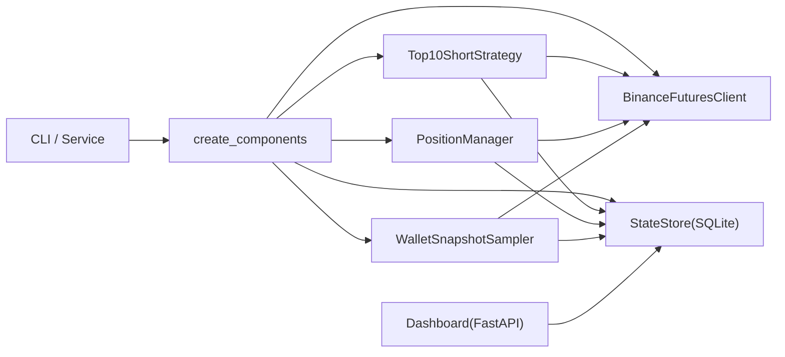

# Bubble Buster

币安 U 本位合约策略项目，核心是：
- 每日固定时间做一次 Top N 涨幅做空入场；
- 持仓巡检（止盈/止损/超时/动态止损）；
- 每日定时浮亏砍仓；
- 早盘保护止损（07:55 对持有超 6 小时仓位按当前小时高低点收紧止损）；
- 中午保护止损（12:00 以 0 点/入场后到 12 点最高价收紧止损）；
- 12:00 后阴线确认入场使用“前一根非阴线 + 触发阴线”两小时结构高点作为初始保护，且跨日只收紧不放宽；
- 本地 Dashboard 可视化；
- SQLite 落库，便于回放和排障。

---

## 1) 项目分析（基于当前代码）

### 核心入口与职责

- `main.py`
  - CLI 主入口，支持 `entry / manage / loss-cut / service / dashboard`。
  - 启动前做文件锁，防止重复执行。
- `core/runtime_components.py`
  - 统一装配 `BinanceFuturesClient / AccountSnapshotProvider / User Stream / StateStore / Strategy / PositionManager / WalletSnapshotSampler`。
- `core/runtime_service.py`
  - 内置调度器（替代 cron），按时驱动 `entry + daily loss-cut + morning protection + noon protection + hourly take-profit + manage`。
- `core/strategy_top10_short.py`
  - 日内入场主逻辑（TopN 选币、按余额分配、做空、挂 TP/SL、失败缩量重试、风险兜底平仓）。
- `core/position_manager.py`
  - 持仓巡检与管理（TP/SL 成交处理、超时平仓、动态止损、每日浮亏砍仓、早盘保护止损、中午保护止损）。
  - 浮亏砍仓支持两种范围：
    - `tracked`：只处理策略数据库中 OPEN 仓位；
    - `exchange`：扫描交易所账户当前全部持仓并对浮亏仓位平仓。
- `core/balance_sampler.py`
  - 从每账户每分钟共享的 `/fapi/v3/account` 快照采集权益；现金流每分钟一次无 `incomeType` 增量同步并在本地筛选。
- `dashboard_fastapi.py` + `dashboard_server.py`
  - Dashboard API 与前端页面渲染。
  - 支持策略权益曲线、账户权益曲线、回撤统计、仓位/事件/日志。
  - HTTP 请求路径只读取 SQLite，不直接调用 Binance。
- `infra/binance_futures_client.py`
  - 交易 API 封装（签名、重试、规则归一化、条件单 fallback）。
- `core/state_store.py` + `schema.sql`
  - 状态持久化（runs/positions/order_events/fills/wallet_snapshots/cashflow_events/rebalance_cycles/rebalance_actions/locks）。

### 当前实现特点（重要）

- 幂等：`entry` 按 `trade_day_utc` 防重。
- 风控兜底：
  - 入场后挂 TP/SL 失败会触发风险平仓；
  - 止损条件单不支持时会降级到 `reduceOnly`。
- 调度容错：
  - `entry` 有 grace 与 catch-up 选项；
  - `manage` 有 catch-up 上限，避免补跑风暴；
  - `service` 内置的 daily loss-cut 是严格 1 分钟窗口，错过当天跳过。
- 可运维性：
  - `log_dir/db_path/lock_file` 可配置，支持多实例隔离（比如账户 A、B）。

### Binance 权重控制

- 每账户同一分钟只抓取一次完整账户快照，权益、组合止盈/止损、仓位巡检与 Dashboard 共享该状态。
- `positionRisk` 只在启动、重连、状态不确定、成交后本地风险字段尚不完整或 5 分钟 REST 校验时按账户全量读取；正常巡检不做 symbol 级请求。
- TP/SL 状态由 `ORDER_TRADE_UPDATE`、`ALGO_UPDATE` 和 `ACCOUNT_UPDATE` 写入本地表，REST 仅作校验兜底。
- 4 个实盘账户现金流在每分钟的 05/20/35/50 秒各发一次无类型过滤的 `/income` 请求，使用持久游标、20 分钟默认重叠和 `tranId/tradeId` 去重。
- readonly 账户仅首次回填 30 天原始流水/成交，之后每 15～30 分钟增量同步并从 SQLite 计算统计；无新 `REALIZED_PNL` 时不调用 `userTrades`。
- 排名使用本地 UTC 日开盘、每日最多一次全市场 ticker 与 24 小时 `exchangeInfo` 缓存；REST 补齐受 200 weight/min 限制。
- 进程内统一非交易预算为 300 weight/min，后台任务预算为 200 weight/min；收到 429/418 后所有非交易 REST 共享冷却。

---

## 2) 执行流（简图）


```mermaid
flowchart LR
  A["CLI / Service"] --> B["create_components"]
  B --> C["BinanceFuturesClient"]
  B --> D["StateStore(SQLite)"]
  B --> E["Top10ShortStrategy"]
  B --> F["PositionManager"]
  B --> G["WalletSnapshotSampler"]
  E --> D
  F --> D
  G --> D
  E --> C
  F --> C
  G --> C
  H["Dashboard(FastAPI)"] --> D
```

---

## 3) 运行前准备

```bash
PROJECT_DIR=/root/bubble_buster
cd "$PROJECT_DIR"
python3 -m pip install -r requirements.txt
cp config.ini.example config.ini
```

至少填写：
- `[binance]` `api_key` / `api_secret`
- `[notify]` `enabled` / `serverchan_sendkey`（可选）

---

## 4) 运行方式

### A. 内置调度服务（推荐单进程）

```bash
cd /root/bubble_buster
python3 main.py --config /root/bubble_buster/config.ini service
```

会自动执行：
- 定时 `entry`
- 定时 `daily loss-cut`
- 周期 `manage`
- 周期余额快照

### B. Dashboard（FastAPI）

方式 1（推荐）：
```bash
cd /root/bubble_buster
python3 main.py --config /root/bubble_buster/config.ini dashboard --host 0.0.0.0 --port 8787
```

方式 2（等价）：
```bash
cd /root/bubble_buster
BUBBLE_BUSTER_CONFIG=/root/bubble_buster/config.ini \
uvicorn app.main:app --host 0.0.0.0 --port 8787
```

### C. 单次命令

```bash
cd /root/bubble_buster

# 单次入场
python3 main.py --config /root/bubble_buster/config.ini entry

# 单次巡检
python3 main.py --config /root/bubble_buster/config.ini manage

# 巡检循环
python3 main.py --config /root/bubble_buster/config.ini manage --loop

# 单次浮亏砍仓
python3 main.py --config /root/bubble_buster/config.ini loss-cut
```

---

## 5) 账户 A / B 隔离最佳实践

### 目标

- 账户 A：保持现有自动化交易（例如 systemd 跑 `service`）。
- 账户 B：只做“每天北京时间 11:55 浮亏砍仓”。

### 配置隔离（必须）

账户 B 使用单独配置：`config_b.ini`（项目已提供模板）。

关键项：
- `daily_loss_cut_enabled = true`
- `daily_loss_cut_hour = 11`
- `daily_loss_cut_minute = 55`
- `daily_loss_cut_scope = exchange`
- `lock_file = runtime_b.lock`
- `db_path = state_b.db`
- `log_dir = logs_b`

### cron（账户 B 专用）

```cron
CRON_TZ=Asia/Shanghai
55 11 * * * /usr/bin/python3 /root/bubble_buster/main.py --config /root/bubble_buster/config_b.ini loss-cut
```

说明：
- 这条任务只跑 `loss-cut`，不会触发 `entry/manage/service`。
- `loss-cut` 下单使用 `reduceOnly`，不会开新仓。

---

## 6) 关键配置说明

### `[strategy]`

- `top_n`：入场目标币种数。
- `allocation_splits`：余额切分份数（每份作为基准保证金）。
- `entry_fee_buffer_pct`：入场前预留手续费缓冲。
- `entry_shrink_retry_count` / `entry_shrink_step_pct`：保证金不足时缩量重试。
- `tp_price_drop_pct`：止盈触发跌幅（做空方向）。
- `fixed_take_profit_enabled`：是否挂固定单仓止盈单；关闭后只挂止损，止盈主要交给小时级保护止盈/组合止盈等主动退出逻辑。
- `sl_liq_buffer_pct`：止损参考清算价缓冲。
- `max_hold_hours`：超时平仓阈值。
- `equity_recovery_take_profit_enabled`：是否启用“24h 低点反弹后组合止盈减仓”。
- `equity_recovery_lookback_hours`：反弹判定窗口（小时）。
- `equity_recovery_trigger_pct`：触发阈值，当前权益 >= 窗口最低权益 * (1 + 阈值) 时触发。
- `equity_recovery_reduce_ratio`：触发后组合减仓比例（按每个持仓当前仓位比例减仓）。
- `entry_wait_close_grace_sec`：整点 K 线收盘后的最短确认缓冲，默认 `1` 秒。
- `entry_wait_close_retry_sec` / `entry_wait_close_retry_count`：收盘 K 线尚未可读或请求失败时的秒级重试间隔与每轮次数，默认 `1` 秒 / `5` 次；一轮耗尽后按短间隔再次尝试，不再退回 30 秒轮询。
- `entry_wait_poll_sec`：收盘前的粗粒度唤醒间隔；收盘后的 K 线读取不使用这个 30 秒间隔。
- `entry_preclose_sec`：提前读取正在形成的小时 K 线并尝试入场的秒数，默认 `10`；设为 `0` 可恢复整点确认后入场。提前入场会在整点后补记最终 K 线结果。
- `entry_scale_in_mode`：分批入场模式，默认 `none`；设置为 `after_bullish_bearish` 时，首根确认阴线开第一笔，默认开仓目标金额的 50%，确认出现 1h 阳线后再等后续 1h 阴线追加剩余仓位。两笔使用同一个逻辑仓位，追加后会重挂整笔仓位的止盈止损；设置为 `after_bullish_bearish_independent` 时，信号规则相同，但如果第一笔已经退出，后续信号会新建独立仓位，并单独计算结构保护止损、止盈止损和持仓生命周期。
- `entry_scale_in_first_ratio`：分批模式下第一笔占完整目标金额的比例，默认 `0.50`，范围为 `0.05`～`0.95`；第二笔自动使用剩余比例。
- 旧版低点反弹止盈时间窗口：按 `runtime.timezone` 的本地时间判断，`07:30` 到 `12:00`（含边界）内不会触发；该限制只作用于 `equity_recovery_take_profit_*`，不作用于每日 08:00 基准组合止盈。

### `[runtime]`

- `timezone`：调度时区（建议 `Asia/Shanghai`）。
- `entry_hour` / `entry_minute`：入场时间。
- `entry_misfire_grace_min`：entry 允许补跑窗口。
- `entry_wait_max_hours`：等待首根 1h 阴线的最长时间，同时不会跨过本地自然日；等待状态会持久化并在重启后恢复。
- 12:00 后才等到首根 1h 阴线时，初始止损取前一根非阴线与触发阴线两小时最高价，并包含阴线收盘到实际成交之间的价格；保护状态按仓位持久化。
- `entry_catchup_enabled`：错过是否补跑。
- `portfolio_loss_cut_enabled`：是否启用按账号计算的日内组合止损。启用后以本地时间 `portfolio_loss_cut_hour:portfolio_loss_cut_minute` 后的第一条有效权益快照为当日基准。
- `portfolio_loss_cut_pct`：组合权益相对当日基准的最大允许跌幅；例如 `3.5` 表示权益降至基准的 `96.5%` 或以下时，平掉该账号当时已存在的全部非保护白名单仓位。尚未开仓、仍在等待 1h 阴线的 symbol 不会被取消。
- `portfolio_loss_cut_hour` / `portfolio_loss_cut_minute`：组合止损的日切换时间，默认北京时间 `08:00`。触发、平仓完成和失败重试状态持久化在 `locks` 表，服务重启后不会重复发送同一次触发通知。
- 组合止损与 `daily_loss_cut_enabled` 可同时启用；前者处理组合权益跌幅，后者继续在 11:55 检查当时仍持有的亏损仓位。
- `portfolio_take_profit_enabled`：是否启用日周期组合止盈。启用后以本地时间 `portfolio_take_profit_hour:portfolio_take_profit_minute` 后的第一条有效账户权益快照为固定基准。
- `portfolio_take_profit_pct`：组合移动止盈的启动涨幅；例如 `2.5` 表示组合收益达到 `+2.5%` 后开始跟踪本周期峰值。若 `portfolio_take_profit_giveback_pct = 0`，则保持旧版固定阈值行为，达到该涨幅后立即触发。
- `portfolio_take_profit_giveback_pct`：允许回吐的峰值利润比例，取值 `0`～`100`。例如峰值收益为 `+9%`、配置为 `15` 时，触发线为 `+9% × 85% = +7.65%`；该比例针对“峰值利润”，不是账户总权益。峰值及触发状态会持久化，服务重启或本周期中途启用时会从权益快照恢复峰值。
- `portfolio_take_profit_reduce_ratio`：触发后每个实际持仓的止盈比例，取值 `0.05`～`1.0`；`0.50` 表示减仓 50%，`1.0` 表示全部清仓。触发时按 `positionRisk.markPrice` 为每个仓位生成持久化的 `reduceOnly + LIMIT + GTC` 订单计划，重试不会改变原限价或重复叠加数量。
- 组合止盈限价单不会设置固定秒数超时，原有逐仓止盈止损单继续保留作为兜底；限价成交至持仓归零后才取消剩余退出单并标记仓位关闭。若限价单被取消、过期或拒单，会在后续巡检中按原触发价重挂；若原退出单先成交，则清理组合限价单。部分止盈只更新剩余数量，不主动撤销原保护单。
- `portfolio_take_profit_hour` / `portfolio_take_profit_minute`：组合止盈的日切换时间，默认北京时间 `08:00`。每个周期从当日 08:00 持续到次日 08:00，全天监控，没有 07:30～12:00 等触发禁区；每周期最多触发一次，平仓完成和失败重试状态持久化在 `locks` 表（`portfolio_take_profit_v2`）。触发后不会锁定本周期后续策略入场；新入场批次开始前会清理已失效仓位遗留的组合限价单，避免旧 `reduceOnly` 单误伤新仓。
- 组合止盈与再平衡的实际交互、目标单仓公式、后触发新仓口径及 acc01 的 50% 减仓示例，见 [`docs/strategy-understanding-20260821.md`](docs/strategy-understanding-20260821.md)。
- `entry_initial_delay_sec`：账户 entry 启动前的额外等待秒数。
- `entry_symbol_interval_sec`：账户 entry 每个 symbol 之间的额外等待秒数。
- 入场开始前会预热 Binance REST 会话、服务器时间、交易规则、逐币杠杆和数量诊断；整点已收盘的候选币会通过 HTTP 连接池并发读取 1h K 线。
- 成交后会记录参考价、成交价、空单不利滑点、提前触发到成交延迟、收盘到成交延迟和提交到成交延迟；提前入场会在整点后补记最终阴阳线及最终收盘相对临时收盘的变化。审计字段写入对应的开仓订单事件原始 JSON，不新增交易业务表。
- `cooling_off_retry_count` / `cooling_off_retry_delay_sec`：
  - 账户级冷静期重试参数，默认 `0` 表示关闭。
  - 仅对增加空头敞口的下单生效：初始开仓、失败资金再分配、post-entry rebalance 的 `SELL` 补单。
  - 命中 Binance `-4192` 时按配置等待后重试，后续开单会自然顺延。
- `daily_loss_cut_enabled` / `daily_loss_cut_hour` / `daily_loss_cut_minute`：每日浮亏砍仓开关与时间。
- `daily_loss_cut_scope`：
  - `tracked`：只看策略跟踪仓位；
  - `exchange`：看账户全仓位（账户 B 建议）。
- `morning_protection_enabled` / `morning_protection_hour` / `morning_protection_minute` / `morning_protection_min_hold_hours`：
  - 早盘保护止损开关、时间和最小持仓时长，默认 `07:55` / `6h`。
  - 同时支持策略跟踪仓位和交易所实际持仓。
  - 规则：到触发时，对持有时间不少于 `min_hold_hours` 的仓位按方向收紧保护止损。
    - 空仓：止损参考当前小时截至检查时刻的最高价；
    - 多仓：止损参考当前小时截至检查时刻的最低价。
  - morning cap 会持久化到锁状态，后续动态止损不会把它放宽回去。
- `hourly_exchange_take_profit_enabled` / `hourly_exchange_take_profit_minute` / `hourly_exchange_take_profit_drop_pct`：
  - 账户级“整点前保护止盈”任务，默认关闭。
  - 有利跌幅触发阈值默认 `18%`；达到阈值后不会立即退出，而是在后续首根 `1h` 阳线确认后平仓。
  - 只对交易所当前空头仓位生效，适合 `loss_cut_only + exchange` 类账户（例如账号 `55`）。
  - 系统会从该仓位真实开仓时间开始回溯；只要历史上曾达到配置跌幅，且到本地 `59` 分检查时当前 `1h` 正在形成的K线为阳线，就会直接市价平仓。
- `protection_exempt_symbols`：
  - 账户级保护白名单，写在 `[account.<id>.runtime]` 下，逗号分隔，按精确 symbol 匹配，内部会标准化为大写。
  - 命中白名单的 symbol 会跳过所有自动止盈止损保护，包括初始 TP/SL 挂单、动态止损、浮亏砍仓、早盘保护、中午保护、小时级保护止盈、组合权益恢复止盈。
  - 白名单 symbol 仍会出现在 Dashboard 和持仓同步里，只是不再由自动保护逻辑接管。
  - 适合大资金账户保留人工管理的长期仓位，例如：

```ini
[account.55.runtime]
protection_exempt_symbols = XAUUSDT
```

- `noon_protection_enabled` / `noon_protection_hour` / `noon_protection_minute`：
  - 中午保护止损开关与时间（默认 12:00）。
  - 规则：对账户当前持仓按方向设置保护止损；策略跟踪仓位取 `max(当日0点, 入场时间)` 到中午窗口的极值并收紧，非策略仓位以当日 `08:00` 为起点。
- `manager_interval_sec` / `manager_max_catch_up_runs`：巡检周期与补跑上限。
- `default_account_id`：默认账户 ID（单账户兼容场景使用）。
- `max_account_workers`：单进程内并发账户任务 worker 数。
- `account_failure_threshold`：账户连续失败阈值（触发断路器）。
- `account_cooldown_cycles`：断路后冷却周期数。
- `account_task_timeout_sec`：单账户任务超时时间。
- `run_service_with_dashboard`：
  - `true`：Dashboard 启动时同时拉起后台服务；
  - `false`：Dashboard 只做展示（适合你已有 systemd 服务时）。
- `dashboard_summary_cache_sec`：账户总览完整摘要的后台刷新间隔，默认 `5` 秒，范围 `5`–`60` 秒。
- `db_path` / `log_dir` / `lock_file`：实例隔离关键参数。

### `[accounts]`（单进程多账户）

- `enabled`：启用账户列表（逗号分隔），示例 `enabled = acc01,acc02,55`
- `mode.<account_id>`：账户模式，支持 `full` / `loss_cut_only` / `readonly`
- `readonly` 账户由后台账户快照与 User Stream 写入本地状态，不写入策略持仓；Dashboard 只读本地持仓、活动止盈止损和仓位保证金，收益率同时展示名义价值收益率与实际仓位初始保证金收益率。
- 账户覆盖节：
  - `[account.<id>.binance]`
  - `[account.<id>.strategy]`
  - `[account.<id>.runtime]`
  - `[account.<id>.notify]`
- Dashboard 新接口：
  - `GET /api/accounts/summary`
  - `GET /api/accounts/summary/fast`（轻量账户数据，优先返回）
  - `GET /api/accounts/summary/details`（后台缓存的任务与开单进度详情）
  - `GET /api/account/{account_id}/snapshot`

### `[notify]`

- `enabled`：是否发送通知。
- `serverchan_sendkey`：Server 酱 Key。

### `[Settings]`（兼容旧脚本）

- 由 `infra/binance_top10_monitor.py` 的兼容逻辑读取，主流程不依赖它。

---

## 7) 数据库表

- `runs`：每日入场运行记录（含状态/消息）。
- `positions`：仓位生命周期。
- `order_events`：订单事件流水。
- `fills`：从订单回报抽取的成交快照（成交量/均价/手续费/已实现PnL）。
- `wallet_snapshots`：权益快照。
- `cashflow_events`：现金流流水（去重）。
- `account_state` / `account_position_state`：每账户最新共享权益与持仓快照。
- `exchange_order_state`：User Stream 驱动的本地订单状态。
- `binance_income_records` / `binance_user_trades`：readonly 原始增量统计账本。
- `daily_open_prices` / `market_data_cache`：UTC 日开盘、ticker 与 `exchangeInfo` 缓存。
- `rebalance_cycles`：每次再平衡周期汇总（目标/执行结果/跳过原因）。
- `rebalance_actions`：再平衡逐仓动作明细（偏离度/调整量/结果）。
- `equity_recovery_events`：旧版 24h 低点反弹止盈触发事件（窗口最低点、触发权益、减仓结果与明细）。
- `locks`：运行时状态表；旧版反弹止盈使用 `equity_recovery_take_profit_v1`，每日 08:00 基准组合移动止盈使用 `portfolio_take_profit_v2` 记录当前周期的基准、峰值、移动触发线、触发权益、逐币组合限价单计划、订单状态、平仓完成状态与通知去重状态。
`cycle_key` 语义：触发后定义为“触发时刻（新的窗口起点）”。
`window_start_utc` 语义：下一轮 24h 窗口起点锚点（与 rolling 24h 取更晚者）。

---

## 8) 测试

```bash
cd /root/bubble_buster
conda run -n base python -m pytest -q
```

---

## 9) 寻优 SQL 模板

- 模板文件：`optimization_sql_templates.sql`
- 用途：针对 `rebalance_cycles / rebalance_actions / fills` 做效果评估、模式对比与训练样本导出。
- 运行示例：

```bash
cd /root/bubble_buster
sqlite3 state.db < optimization_sql_templates.sql
```

---

## 10) 常见问题

- `Lock busy timeout ...`
  - 两个进程共用了同一个 `lock_file`。给不同实例配置不同 lock 文件。
- Dashboard 显示 service 未运行
  - 你可能已用 systemd 跑了主服务，Dashboard 再启动内置服务会拿不到锁；把 `run_service_with_dashboard=false` 即可。
- `ServerChan enabled but sendkey is empty`
  - 关闭通知或补全 `serverchan_sendkey`。
- cron 执行失败（找不到 python）
  - 用 `which python3` 确认解释器路径并写入 crontab。

---

## 11) systemd 模板（账户 A）

适用场景：账户 A 需要常驻跑整套策略（`service` 模式）。

### `/etc/systemd/system/bubble_buster.service`

```ini
[Unit]
Description=Bubble Buster Strategy Service (Account A)
After=network-online.target
Wants=network-online.target

[Service]
Type=simple
User=root
WorkingDirectory=/root/bubble_buster
Environment=PYTHONUNBUFFERED=1
ExecStart=/usr/bin/python3 /root/bubble_buster/main.py --config /root/bubble_buster/config.ini service
Restart=always
RestartSec=5
TimeoutStopSec=30

[Install]
WantedBy=multi-user.target
```

### 生效与运维命令

```bash
sudo systemctl daemon-reload
sudo systemctl enable bubble_buster
sudo systemctl start bubble_buster

sudo systemctl status bubble_buster --no-pager
sudo journalctl -u bubble_buster -f
```

### 账户 B 与 systemd 的关系

- 账户 B 只跑 cron 的 `loss-cut` 即可，不需要再建一个 `service`。
- 账户 A 的 `bubble_buster.service` 与账户 B 的 `loss-cut` cron 不冲突。
- 若你也要开 Dashboard，建议单独建 `bubble_buster_dashboard.service`，并在配置中将 `run_service_with_dashboard=false`，避免 Dashboard 进程重复拉起策略服务。

### `/etc/systemd/system/bubble_buster_dashboard.service`

适用场景：需要 Dashboard 常驻（通常与 `bubble_buster.service` 并行运行）。

```ini
[Unit]
Description=Bubble Buster Dashboard (FastAPI)
After=network-online.target bubble_buster.service
Wants=network-online.target

[Service]
Type=simple
User=root
WorkingDirectory=/root/bubble_buster
Environment=PYTHONUNBUFFERED=1
Environment=BUBBLE_BUSTER_CONFIG=/root/bubble_buster/config.ini
ExecStart=/usr/bin/python3 -m uvicorn app.main:app --host 0.0.0.0 --port 8787
Restart=always
RestartSec=5
TimeoutStopSec=30

[Install]
WantedBy=multi-user.target
```

### Dashboard 服务生效与运维命令

```bash
sudo systemctl daemon-reload
sudo systemctl enable bubble_buster_dashboard
sudo systemctl start bubble_buster_dashboard

sudo systemctl status bubble_buster_dashboard --no-pager
sudo journalctl -u bubble_buster_dashboard -f
```

### 避免重复启动策略服务（重要）

- 当 `bubble_buster.service` 已运行时，`/root/bubble_buster/config.ini` 中应设置：
  - `run_service_with_dashboard = false`
- 否则 Dashboard 进程会尝试再拉起一套内置策略服务，并可能因为同一 `lock_file` 报锁冲突。

---

## 12) 目录

```text
bubble_buster/
├── main.py
├── app/main.py
├── dashboard_fastapi.py
├── dashboard_server.py
├── core/
│   ├── runtime_components.py
│   ├── runtime_service.py
│   ├── strategy_top10_short.py
│   ├── position_manager.py
│   ├── balance_sampler.py
│   └── state_store.py
├── infra/
│   ├── binance_futures_client.py
│   ├── binance_top10_monitor.py
│   └── notifier.py
├── schema.sql
├── config.ini.example
├── config_b.ini
├── cron.example
└── tests/
```

---

## 风险提示

本项目默认对接主网实盘接口。请先小资金验证，确保 API 权限最小化（关闭提现、绑定 IP、分账户隔离）。交易风险自担。
