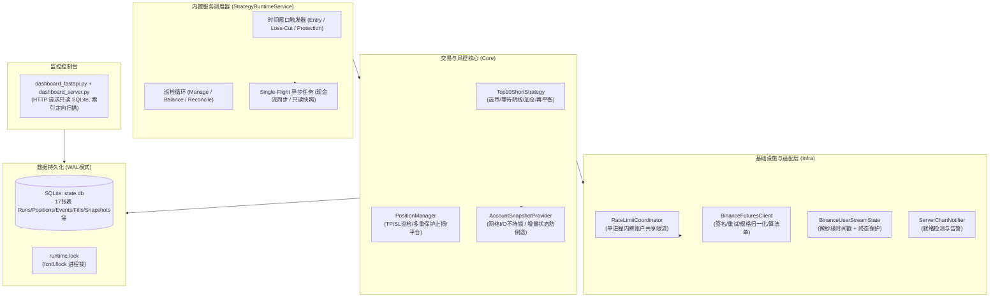
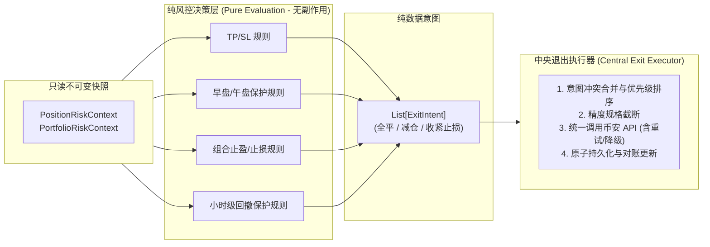
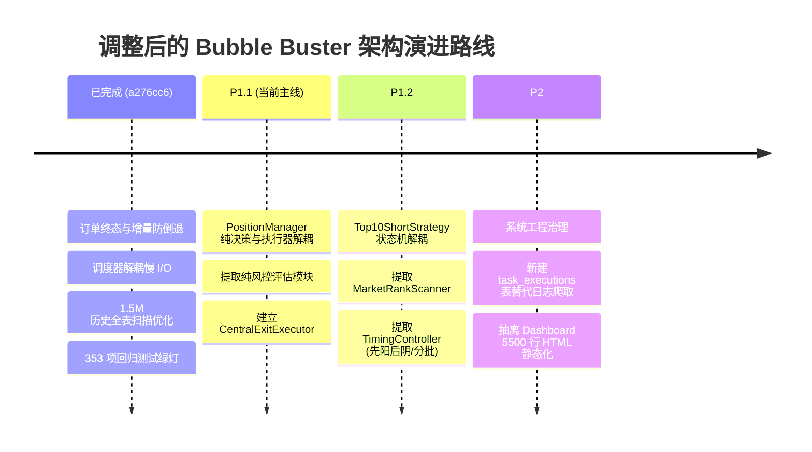
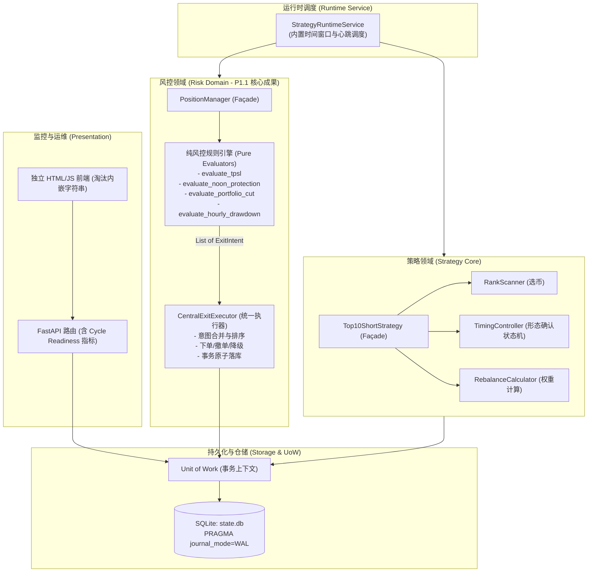

# Bubble Buster 架构评审与演进路线报告 (Architecture Review & Evolution Roadmap)

- **初版日期**：2026-09-04
- **融合更新**：2026-09-05（结合 [Codex 复核意见](file:///Users/zhangshuai/PycharmProjects/bubble_buster/docs/ARCHITECTURE_REVIEW_CODEX.md) 完成全面校准）
- **最新实战校准**：2026-09-25（结合 [2026-09-22 线上审计报告](file:///Users/zhangshuai/PycharmProjects/bubble_buster/docs/audits/2026-09-22/REPORT.md) 与提交 `a276cc6` 落地成果）
- **评审角色**：系统架构师联合评审 (Gemini & Codex)
- **评审范围**：核心交易系统 (`core/`)、交易所适配层 (`infra/`)、看板服务 (`dashboard_*.py`)、数据存储 (`schema.sql` / `core/state_store.py`) 及系统运维调度

---

## 目录

- [执行摘要：实战数据校准与阶段跃迁](#执行摘要实战数据校准与阶段跃迁)
- [一、系统定位与业务全貌](#一系统定位与业务全貌)
- [二、架构设计亮点与实战成果](#二架构设计亮点与实战成果)
- [三、深层架构痛点与真实风险边界](#三深层架构痛点与真实风险边界)
- [四、关键架构模式纠偏（特别附录）](#四关键架构模式纠偏特别附录)
- [五、最新校准的演进路线图 (P1 为主轴)](#五最新校准的演进路线图-p1-为主轴)
- [六、P1.1 改造方案详案：PositionManager 纯函数化](#六p11-改造方案详案positionmanager-纯函数化)
- [七、目标架构全景图](#七目标架构全景图)
- [八、总结与工程准则](#八总结与工程准则)

---

## 执行摘要：实战数据校准与阶段跃迁

在 2026-09-22 的生产环境专项审计及 2026-09-25 的提交 `a276cc6` 中，系统完成了对最致命的底层并发漏洞的修复与线上验证。

本次校准基于真实生产测量数据（150万行快照库、多账户运行实况）确立了三个核心结论：
1. **原 P0 防御风险已实质性闭环**：
   - 订单终态被迟到 REST 倒退、新账户状态被旧 REST 快照覆盖、调度器主循环被现金流 I/O 卡死等竞态已彻底修复；
   - 随之落地的 [`tests/test_audit_probe_regression.py`](file:///Users/zhangshuai/PycharmProjects/bubble_buster/tests/test_audit_probe_regression.py) 构筑了严密的防线（全工程通过用例增至 **353 passed**）。
2. **推翻“SQLite 锁竞争瓶颈”假设，避免过度设计**：
   - 线上 404 MiB 数据库实测表明，WAL 模式下锁争用并未造成线上瓶颈（无锁超时、无死锁）；
   - 真正的性能热点是“遍历 150 万历史行提取最新权益”的慢 SQL，该问题已在 `a276cc6` 中通过索引定位与窗口优化降至毫秒级；因此**数据库写队列或迁移 PostgreSQL 无限期延后**。
3. **路线图主轴正式推进到「P1 核心领域解耦」**：
   - 最紧迫的隐患从“底层崩溃与锁并发”转移到**“业务核心代码巨石化与风控难以隔离测试”**；
   - 即刻启动 **P1.1：`PositionManager` 纯风控决策评估与统一退出执行器分离**。

---

## 一、系统定位与业务全貌

### 1.1 业务属性
Bubble Buster 是一套针对**币安 USDT 永续合约 (Binance USDT-M Futures)** 的多账户量化交易系统。
核心策略模型为：
- **定时 Top-N 涨幅做空**：固定时间（如 07:40 / 08:00）筛选全市场日内涨幅最大的币种，等待 1 小时阴线（或先阳后阴结构确认）分批做空；
- **分层风控矩阵**：固定止盈（TP）、动态移动止盈、早盘保护（07:55 按前高止损）、中午保护（12:00 按区间最高价止损）、小时级盈利回撤止盈（如 18% 回撤保护）、日内定时浮亏砍仓（11:55）、组合级止盈止损（-3.5% 止损 / +9% 减仓或清仓）；
- **动态再平衡与资金分配**：依据账户净值、杠杆与资金利用率动态调整新旧仓位权重；
- **多账户隔离机制**：支持独立全功能交易账户（`acc01`~`acc04`）、砍仓专用账户（`loss_cut_only`）、只读监控账户（`readonly`）。

### 1.2 运行时拓扑
系统采用单进程服务（`main.py service`）内置调度循环，替代外部 crontab；同时通过 FastAPI 与 SQLite 本地缓存提供实时监控看板。

---

## 二、架构设计亮点与实战成果

系统在实盘严苛环境下沉淀了大量优质的工程设计，并在最新提交中完成了关键升级：

1. **出色的交易所权重控制与分层缓存**：
   - **进程级限流协调**：在 [`infra/binance_rate_limit.py`](file:///Users/zhangshuai/PycharmProjects/bubble_buster/infra/binance_rate_limit.py) 中实现了跨账户共享的限流协调器（`RateLimitCoordinator`），为交易请求与后台请求分别划分预算（如 300 vs 200 weight/min），并在收到 `429/418` 时触发统一冷却。
   - **账户快照与无锁 I/O**：通过 [`core/account_snapshot.py`](file:///Users/zhangshuai/PycharmProjects/bubble_buster/core/account_snapshot.py)，同一账户每分钟仅调用一次 REST 账户接口；最新修复确保了**在发起 HTTP 请求时不占用内部锁**，不再阻塞并发到达的 WebSocket 用户流。
   - **流式感知与严格状态机**：通过 [`infra/binance_user_stream.py`](file:///Users/zhangshuai/PycharmProjects/bubble_buster/infra/binance_user_stream.py) 依靠 WebSocket 维护订单状态；在 [`core/state_store.py`](file:///Users/zhangshuai/PycharmProjects/bubble_buster/core/state_store.py) 中建立了终态保护（FILLED/CANCELED 不会被迟到的 REST 覆盖回 NEW），`executed_qty` 保持单调递增。

2. **强幂等锚点与非阻塞调度**：
   - `runs` 表以 `(account_id, trade_day_utc)` 作为复合唯一键，保障日内入场逻辑幂等；资金流水使用持久游标和 `tranId/unique_key` 去重。
   - 调度器通过单飞（Single-flight）异步调度将流水同步等慢 I/O 移出主调度循环，保障了核心入场与保护巡检的准点触发。

3. **扎实的自动化测试防线**：
   - 包含 23 个测试模块，总计 **353 个通过测试（353 passed）**，包含完整的探针回归测试 [`tests/test_audit_probe_regression.py`](file:///Users/zhangshuai/PycharmProjects/bubble_buster/tests/test_audit_probe_regression.py)，为接下来的重构提供了高密度的安全气囊。

---

## 三、深层架构痛点与真实风险边界

经过 9-22 线上审计数据过滤，排除了“虚假风险”，当前阻碍系统进一步迭代的核心痛点聚焦在以下三项：

### 1. 核心模块过深，业务逻辑膨胀至临界点
全工程生产 Python 代码中，约 73% 集中在四个巨型文件中：
- [`dashboard_server.py`](file:///Users/zhangshuai/PycharmProjects/bubble_buster/dashboard_server.py)（**9,485 行**）：内嵌 **5,500+ 行原生 HTML/CSS/JS 字符串**，混合了 SQL、数据聚合与页面拼装。
- [`core/strategy_top10_short.py`](file:///Users/zhangshuai/PycharmProjects/bubble_buster/core/strategy_top10_short.py)（**5,005 行**）：近期连续增加了“先阳后阴（bullish-then-bearish）”、“分批加仓（scale-in）”、“信号独立模式”等，状态机逻辑极度厚重，选币、状态跟踪与订单执行紧耦合。
- [`core/position_manager.py`](file:///Users/zhangshuai/PycharmProjects/bubble_buster/core/position_manager.py)（**4,450 行**）：平铺了 7 大类巡检与保护逻辑（`run_once`, `run_noon_protection_stop`, `run_morning_protection_stop`, `run_hourly_exchange_take_profit`, `run_daily_loss_cut`, `run_portfolio_loss_cut`, `run_portfolio_take_profit`）。规则判断与网络下单、落库混织在一起，无法做纯粹的单元测试。
- [`core/state_store.py`](file:///Users/zhangshuai/PycharmProjects/bubble_buster/core/state_store.py)（**2,401 行**）：77 个方法，职责过宽。

### 2. 反模式：依赖日志正则解析推断运行状态（Log Scraping）
- 看板为了获知入场进度，依然通过 `_task_log_parse_state` 正则扫描本地 `strategy.log` 文件。
- 日志一旦微调文案，前端监控直接失效，属于典型的高耦合反模式。

### 3. 弱类型与贫血数据结构
- 虽然有部分 `@dataclass`，但在模块间流转时仍大量充斥着 `row.get("symbol")`、`order.get("updateTime")` 等弱类型字典，重命名或字段访问失误极难在静态分析期被捕捉。

---

## 四、关键架构模式纠偏（特别附录）

重构推进中，必须坚守以下三个经过推演的设计红线：

### 1. 为什么坚决不用“责任链模式（Chain of Responsibility）”？
* 责任链将对象沿链条传递，每个节点自主决定处理或退出。但在量化风控中：
  - **组合风控不是单仓决策**：组合止损（-3.5%）是跨全仓位的宏观聚合计算；
  - **动作不只是退出**：很多保护动作是“收紧止损限价（Tighten Stop Loss）”；
  - **副作用不可失控**：各规则如果直接调用交易所 API，会造成严重的挂单冲突与竞态。
* **终极解法：函数式核心，指令式外壳（Functional Core, Imperative Shell）**：
  $$\text{只读不可变快照 (Context)} \xrightarrow{\text{纯风控决策 (Pure Evaluation)}} \text{风险意图列表 (ExitIntents)} \xrightarrow{\text{统一执行器 (Exit Executor)}} \text{合并/排序/下单/落库}$$

### 2. 避免无脑拆分 Repository 破坏事务完整性
- 订单事件（`order_events`）、仓位更新（`positions`）与成交流水（`fills`）必须在同一事务中原子更新。
- 仓储治理应以**业务聚合根（Aggregate Root）**与 **Unit of Work** 为边界，绝不搞“一张表对应一个类”的教条拆分。

### 3. 工具库按语义拆分，拒绝垃圾抽屉
- 提取 `core/time_utils.py` 与 `core/math_utils.py`，客户订单号等业务标识符生成保留在交易域。

---

## 五、最新校准的演进路线图 (P1 为主轴)

---

## 六、P1.1 改造方案详案：PositionManager 纯函数化

作为接下来首要落地的任务，P1.1 的实施方案如下：

### 目标
在保持 `PositionManager` 外部公开接口（`run_once`, `run_noon_protection_stop` 等）签名和运行时行为 **100% 不变** 的前提下，将其内部深重耦合的代码解耦为**决策**与**执行**两大部分。

### 实施成果与模块交付 (已完成)

1. **不可变领域模型 (`core/risk/models.py`)**：
   - 退出意图类型枚举 `ExitActionType` (`NOOP`, `UPDATE_STOP_LOSS`, `CLOSE_POSITION`, `REDUCE_POSITION`)
   - 不可变意图载体 `ExitIntent`（支持标的、动作、目标价、数量、买卖方向、持仓模式、原因、元数据）
   - 各风控规则的输入与结果数据结构（`NoonProtectionEvaluationInput/Result`、`MorningProtectionEvaluationInput/Result`、`DailyLossCutEvaluationInput/Result`、`HourlyExchangeTakeProfitEvaluationInput/Result`、`PortfolioLossCutEvaluationResult`、`PortfolioTakeProfitEvaluationResult`）

2. **纯计算与决策引擎 (`core/risk/evaluators.py`)**：
   - `calculate_noon_protection_window_start(...)`
   - `calculate_merged_stop_loss(...)`
   - `evaluate_noon_protection_candidate(...)`
   - `is_morning_protection_hold_satisfied(...)`
   - `resolve_morning_protection_old_sl(...)`
   - `evaluate_morning_protection_candidate(...)`
   - `calculate_portfolio_cycle_window(...)`
   - `evaluate_daily_loss_cut_candidate(...)`
   - `evaluate_hourly_take_profit_candidate(...)`
   - `evaluate_portfolio_loss_cut_threshold(...)`
   - `evaluate_portfolio_take_profit_threshold(...)`
   - `calculate_dynamic_stop_price(...)`
   - `evaluate_dynamic_stop_candidate(...)`
   *零网络 I/O、零数据库依赖、零副作用，毫秒级纯数学与规则判定。*

3. **集中退出执行器 (`core/risk/executor.py` -> `CentralExitExecutor`)**：
   - `execute_stop_loss_intent(...)`：负责止损单下发、-2021 立即触发降级市价平仓、DB 事务落库与失败回滚、旧单取消
   - `close_position(...)` / `close_protection_immediate(...)`：统一市价平仓、对账记录、本地仓位标记与保护撤单
   - `cancel_exit_orders(...)` / `cancel_order_if_exists(...)`：旧止损/止盈单原子撤回

4. **`PositionManager` 成为精简的调度 Façade**：
   - `run_noon_protection_stop`：仅负责上下文提取、调用纯判定引擎、委托 `exit_executor`
   - `run_morning_protection_stop`：同上
   - `run_daily_loss_cut`：委托纯判定引擎与 `exit_executor.close_position`
   - `run_hourly_exchange_take_profit`：委托纯判定引擎与 `exit_executor.close_position`
   - `run_portfolio_loss_cut`：委托 `calculate_portfolio_cycle_window` 与 `evaluate_portfolio_loss_cut_threshold`
   - `run_portfolio_take_profit`：委托 `evaluate_portfolio_take_profit_threshold`
   - `_update_dynamic_stop`：委托 `evaluate_dynamic_stop_candidate` 与 `exit_executor.execute_stop_loss_intent`
   - `_close_timeout`：委托 `exit_executor.close_position`

5. **自动化测试与回归保障**：
   - 新增 `tests/test_risk_evaluators.py`（38 个纯函数单元测试）
   - 新增 `tests/test_risk_executor.py`（6 个执行器单测）
   - 全量回归测试：**397 项测试全部通过（0 失败，100% 绿灯）**。

---

## 七、目标架构全景图

---

## 八、总结与工程准则

通过 9-22 审计报告的客观核验与 `a276cc6` 的成功合入，Bubble Buster 证明了其极高的实战可靠性。

接下来的重构将严格遵循：
1. **接口不变性（Preserve External Interface）**：所有对外界（`main.py` / `runtime_service.py`）暴露的方法签名和返回值结构严格保持兼容；
2. **纯函数先行（Pure Functions First）**：先把业务规则写成纯函数，建立 100% 单测，再把老代码替换为对纯函数的调用；
3. **保持测试绿灯（Keep Green）**：每个小步骤提交前必须确保 353 个现有测试全部通过。
