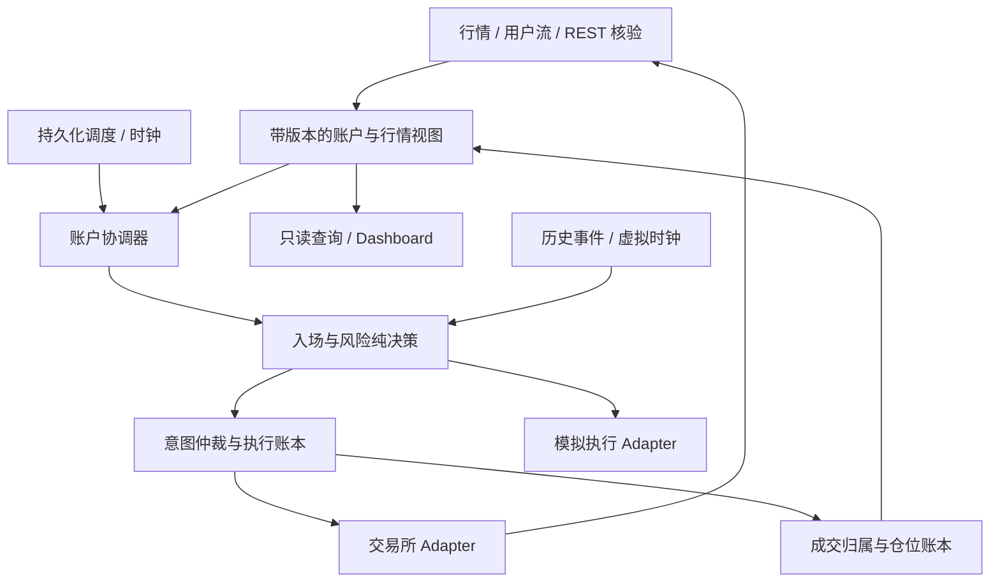

# Bubble Buster：从第一性原理出发的系统重构方案

日期：2026-09-26。代码基线：`36170b9`。范围：运行时、交易执行、状态存储、行情与用户流、Dashboard、回放研究。

本次只产出设计，不修改交易行为、不操作交易账户。基于本地源码和测试，未核验线上部署、实际订单或性能指标。下文将代码事实、结构风险和目标设计区分描述。

## 1. 结论与重构目标

需要完整重构交易核心，但应按业务链路逐段替换。问题不是缺少类，而是**系统尚未统一回答：这笔业务动作是谁的、想做到什么、交易所实际做了多少、失败后应该从哪里继续。**

目前已有风险纯函数、CentralExitExecutor、TimingController、RebalanceCalculator、AccountSnapshotProvider、UnitOfWork、结构化任务记录和外置模板。应复用这些成果。继续围绕大类抽函数而不转移状态所有权，会保留原来的复杂度，同时增加调用层级。

重构的完成标准：新增一种策略规则时，通常只修改决策模块及对应行为测试；不必同步修改订单重试、仓位恢复、日志解析、Dashboard 和独立回测实现。

推荐继续使用 Python 模块化单体、SQLite、现有交易所 adapter。暂不引入微服务、消息中间件、通用规则 DSL 或全量事件溯源；数据库替换由测量结果决定。

## 2. 第一性原理：系统必须维护什么

系统本质上是一个在不可靠网络下，根据时序信息控制账户敞口、并能恢复和解释每次决策的程序。

必须建立以下不变量：

1. **意图与事实分离。** 想平仓、已提交、已受理、部分成交、全部成交、仓位归零，是不同事实。
2. **身份贯穿生命周期。** account、positionSide、逻辑仓位、入场批次、订单意图、交易所订单、逐笔成交必须能稳定关联。
3. **未知不等于失败。** 请求超时后，先查询与核对；无法证明未执行时，不能换一个 ID 再开一笔。
4. **每个账户只有一个交易决策与执行所有者。** 行情可并行采集，但同一份敞口不能被相互不知情的任务同时修改。
5. **恢复与正常执行遵循同一状态机。** 重启只改变从哪个状态继续，不另写一套猜测业务含义的逻辑。
6. **风险动作必须声明范围。** 账户级、策略级、逻辑仓位级不能混用；一次触发针对哪些仓位、多少数量，应留下记录。
7. **保护约束属于仓位生命周期。** 跨日继续有效，旧仓位退出后的保护单不能归属新仓位；只收紧的规则必须在一个地方实施。
8. **决策只能使用当时可获得的信息。** 数据有事件时间、接收时间、来源和可信状态；未收盘 K 线不能伪装成收盘事实。
9. **同一输入与规则版本产生同一决策。** 实盘和回放共享规则，成交模拟的差异单独声明。
10. **观测数据不能反向控制交易事实。** 日志和页面是解释、展示渠道，不能承担交易恢复或任务状态的最终裁决。

## 3. 现状证据与结构性问题

行数仅作为导航：strategy_top10_short 4694 行，position_manager 4382 行，state_store 2789 行，runtime_service 1632 行，dashboard_server 4000 行。重构优先级不按行数排序。

| 问题 | 代码证据 | 结构性后果 |
|---|---|---|
| 交易执行入口未统一 | `core/risk/executor.py:104` 先下单再进入 UoW；策略、组合止盈、补挂 TP 等仍直接 `create_order`，见 strategy:2669/3155/3385，manager:1621/1933/3478 | 本地事务不能覆盖外部订单副作用，不同路径各自承担未知结果与恢复 |
| 逻辑仓位与交易所净敞口关联偏隐式 | `infra/binance_user_stream.py:399` 通过 symbol 找第一个 OPEN 仓位；`core/strategy_top10_short.py:2804` pending entry 恢复从 symbol 的实际仓位取得数量 | 对同币复用、二次入场、人工持仓及延迟事件，归属依赖外围约束；不是已证实发生错配，但模型无法直接表达所有权 |
| 重要业务状态藏在通用 JSON 中 | entry wait、组合止盈/止损、早午保护、待补成交均使用 `locks`；`core/state_store.py:940` 从入场审计 payload 找待完成结构保护 | 报告元数据、恢复队列、规则状态互相渗透；版本迁移与一致性难集中控制 |
| 账户串行化存在，但锁内会等待 | `runtime_components.py:185` 建共享 RLock；strategy:1241 的受锁方法在 1270 附近等待最终 K 线，随后查询行情 | 账户锁提供局部串行保证，但耗时 I/O 可能阻塞其他保护动作；需测量，不能直接声称线上已超时 |
| 本地事务内仍可能调用网络 | executor 的 UoW 中调用 `MarketFillReconciler.record_market_order`，其 `_build_fill_payload` 在 reconciler:229 查询 userTrades | 已执行写操作后等待网络会延长数据库写事务；UoW 本身不解决执行与对账的职责问题 |
| 组合触发范围缺少统一表示 | manager:681 调用全仓扫描；manager:2084 每次执行重新读取当前仓位；组合限价止盈另有持久化 plan | 止损重试目标与止盈计划采用不同模型，后入场是否被旧触发波及需单独验证 |
| 结构化状态仍未完全替代日志推断 | dashboard_server:1084 先解析日志，再与 runs/task_executions 按新旧合并；schema:349 的 task_executions 是执行记录 | 任务“展示状态”和“执行状态”没有彻底归一；已有记录表不等于可恢复调度状态机 |
| Web 启停与交易运行可耦合 | dashboard_fastapi:521 启动交易后台；配置默认 run_service_with_dashboard=true | 页面进程重启及扩容与交易运行所有权发生联系，即使已有文件锁也增加运维隐含规则 |
| 回放重写了业务规则 | `scripts/backtest_wait_1h_bearish_strategy_replay.py:459` 独立实现中午窗口；本地未跟踪的 replay_independent_strategy_portfolio.py 又定义入场和组合参数 | 研究代码与实盘可能漂移；当前不宣称已有研究结论错误 |

已有的保护措施必须保留：账户级锁、PENDING_ENTRY/PENDING_EXIT_SETUP、OrderStateUnknownError、条件单兼容、REST 校验、限流协调、成交补录、多账户隔离与现有回归测试。不能把“没有统一协议”误写成“完全没有恢复”。

还有一个需要契约化的例子：README 明确组合止损不取消等待中的新入场，但 manager:584 的 docstring 仍描述触发后当日禁止重开。文档描述与实现意图的分歧应通过业务场景验收消除，而不是任选一段注释作为规格。

## 4. 目标领域模型：先把身份和事实建对

| 概念 | 身份 / 内容 | 所有者 |
|---|---|---|
| StrategyRun | account + strategy + business_cycle；规则及配置版本 | 入场决策 |
| EntryPlan / EntryLeg | 某 run 的候选、第一/第二笔、预算、下一唤醒时间、信号状态 | 入场决策 |
| PositionEpisode | 一次逻辑持仓生命周期；episode_id；可由多笔 leg 增仓 | 仓位账本 |
| ExchangeExposure | account + symbol + positionSide 下当前真实总数量 | 交易所状态模块 |
| OrderIntent | 某业务动作的目标数量/价格、scope、episode、预期状态版本、稳定业务键 | 执行模块 |
| OrderAttempt | intent 下的一次具体提交，稳定 client ID、受理状态、替代关系 | 执行模块 |
| ExecutionFill | 交易所逐笔成交唯一身份、数量、价、费、订单关联 | 成交账本 |
| ProtectionPolicyState | episode 的保护约束、原因、有效期、版本 | 风险决策 |
| RiskCycle / TargetSet | 账户周期基准、峰值、触发时目标集合和完成进度 | 风险决策 |
| AccountView | 带版本、可信状态及各来源时间的账户事实视图 | 状态投影 |
| TaskOccurrence / Attempt | 应触发的一次任务与多次尝试分离 | 调度模块 |

第一笔未退出时追加：新 EntryLeg 归属于原 PositionEpisode。独立模式下第一笔已退出，第二笔创建新 episode，旧保护约束和旧订单不能继承。交易所净仓位不是任意一条 episode 的数量。

如同账户同方向同时存在多个逻辑 episode，必须用成交分配关系显式记账。无法识别的人工增减仓记为外部调整/待核对，不能把总仓位直接塞进第一个逻辑仓位。第一阶段可继续限制同方向只有一个活跃策略 episode，但限制要有校验和可解释的拒绝结果。

数量和价格在决策、订单与账本中使用 Decimal 或最小单位整数；展示阶段才转浮点。价格和数量舍入集中在交易所 adapter。历史 REAL 数据不能假装恢复丢失精度，迁移时保留原值并按交易规则规范化。

## 5. 目标模块与小接口

采用聚焦的 Module，并围绕真实 Seam 放置 Interface：

- **DecisionKernel**：`decide(state, observation, clock, policy) -> Transition`。Transition 包含新业务状态、理由和意图，无网络或数据库操作。内部复用现有 timing、risk evaluators 和 rebalance calculator。
- **ExecutionEngine**：`submit(intent) -> handle`、`advance(observation) -> progress`。隐藏查单、重试、部分成交、撤改单、数量预留、未知结果和恢复；调用者不再传入 client ID 生成函数及不同 close_status 组合。
- **AccountCoordinator**：接收观察结果与到期任务，按账户串行决定短步骤；外部采集并行，结果回投。与其他账户独立运行。
- **TradingLedger**：提交相关业务状态与意图、归并订单事实与成交归属。提供短事务，保留 UoW，禁止事务内部等待网络。
- **Market/AccountData**：输出带来源与版本的视图；显式 CERTAIN/STALE/RECONCILING。交易所未提供全局序列时不能虚构序列一致性，以来源时间、终态单调合并与 REST 对账收敛。
- **QueryModule**：返回版本化 Dashboard/报告模型；不装配交易 client，不创建交易线程，不解析日志决定任务是否成功。

无需为每张表创建一个 repository，也无需把每个规则包装成类。真正需要可替换 adapter 的 Seam 是交易所/模拟执行、实时时钟/虚拟时钟、实时观察/历史观察。其余模块可使用简单函数和具体实现。

## 6. 订单执行协议：本轮重构最优先的纵向链路

1. 在短事务中提交业务状态迁移和 OrderIntent；业务键唯一。随后提交 OrderAttempt 与 client ID，再发请求。
2. 网络请求在事务外执行。请求返回、用户流事件和 REST 对账统一进入归并路径。
3. `PREPARED -> SUBMITTING -> ACKNOWLEDGED -> PARTIALLY_FILLED -> FILLED`；另有 `REJECTED/CANCELED/EXPIRED/UNKNOWN`。订单终态与意图完成分离：一个限价 attempt 被取消，并不意味着目标减仓意图完成。
4. 超时转 UNKNOWN。按已持久化 client ID 查单，结合成交和敞口核对；不确定期间冻结该 scope 的冲突增仓动作。不能仅因某次查询“没找到”就认定从未下单。
5. 只有确认拒绝、撤销或过期后，才能为剩余目标创建 replacement attempt；新 attempt 有新 ID，保留原 intent 和累计成交。数量缩减重试同样记录修订关系。
6. 成交去重以交易所成交身份为准。累计订单成交只做投影，不能重复作为新成交入账。部分成交与后续完整信息用增量合并。
7. episode 剩余数量、成交、订单进度在同一事务更新；只有事实支持退出完成才关闭 episode。保护单撤销失败作为待完成工作继续跟踪。
8. 新保护单确认生效再取消旧保护单；在切换期间为并存订单计入预留和风险，不因本地成功写库就认为远端撤单已完成。

这是一套可重放、幂等归并、最终收敛的协议，不承诺网络与数据库之间不存在原子性的 exactly-once。

风险动作仲裁规则：同一目标上的全部退出优先于部分减仓，部分减仓优先于再平衡增仓；冲突动作先归并到目标剩余数量，再扣除已成交和未完成订单的预留。不同 episode 的合法等待入场不能被这个优先级误当作全账户禁止入场。

组合触发应先冻结 TargetSet，包括触发时 episode、观察到的敞口和目标减量。旧目标重试不能无条件再次扫描并平掉后来新开的仓位。由于交易所净额模型无法天然区分批次，执行前需要账本分配与最新总敞口核验；未知归属进入核对状态。

保护白名单要集中形成按 account/symbol/action 判断的 Policy，并通过现有行为测试保持其准确范围，不能在此次重构中扩大为“所有动作都豁免”。

## 7. 调度、数据、存储和展示的配套设计

**调度：** 每类任务声明周期键、到期时间、补跑策略、截止时间、重试策略和优先级。EntryPlan 等待 K 线时保存 next_wakeup，而不长时间占用账户锁。TaskOccurrence 唯一键为 account/task/cycle；Attempt 是一对多历史。task_executions 可继续作为读投影，不能直接当作任务领取锁。

账户协调器每一步有耗时上限；保护事件优先处理，但不能越过在途未知订单制造新冲突。线程 Future 超时只表示观测超时，不代表下单已经取消。执行所有权用现有单进程文件锁和显式账户 owner 管理；重启交接先停止旧 writer 并核对在途订单，不能用租约过期证明旧请求不再执行。

**数据：** AccountView 带 revision、各来源 as_of 和 data_quality，策略提交意图附预期 revision，执行前重新校验余额、可减数量和保护约束。共享分钟快照用于降低请求，不能隐式等同于所有交易判断都允许一分钟陈旧。暂不硬编码新的时效阈值，先记录实际延迟，再为增仓与保护分别制定要求。

**存储：** 保留已有事实表与 SQLite WAL。优先增量加入 intent/attempt、episode/leg 关联和 schema_migrations；随后把 entry plans、risk cycles、protection state、reconciliation jobs 从 locks 迁出。每个迁移版本支持 dry-run、行数/数量/归属核验和失败回滚。旧 locks 只在启动迁移时读一次，不能长期新旧双读双写。

当前 `order_events` 更接近订单快照/事件记录，`fills` 每个 order_event 一条聚合信息。不要将其直接宣布为逐笔不可变账本；新逐笔记录优先复用/关联已有 binance_user_trades 的交易身份，旧聚合保留来源和完整度标记。无法推断的历史关联显式标记 UNKNOWN，不能靠 symbol 强行补齐。

UoW 也需契约验收：嵌套 savepoint 的 after_commit 必须在最外层真正提交后执行；当前 uow:119 起的正常退出会在嵌套 release 后执行当前回调，不能将它直接用作可靠发单 outbox。可靠待执行工作持久化后由 dispatcher 读取，不能只靠内存回调。

**Dashboard 与运维：** Web 默认作为独立只读进程，交易由 main service 单独启动；只读账户的后台采集属于 ingestion。保留部署兼容入口一段时间，切换后移除默认 Web 托管交易行为。新任务状态完全来自结构化投影，旧日志回退限定为历史数据展示并设删除阶段。

健康状态分为进程存活、账户事实可用、交易执行可用；展示 UNKNOWN 意图、未保护敞口、待核对数量、状态时间，而不是只报 service_running。关联日志携带 account/run/episode/intent/attempt，禁止日志成为状态源。

**研究与回放：** 复用 DecisionKernel、规则配置与虚拟时钟，替换观察和执行 adapter。成交模拟独立覆盖手续费、滑点、资金费、部分成交、K 线内触发先后和资金约束。只有 OHLC 时无法还原提前 10 秒入场信息，应标记该结果为近似；使用实盘已选 symbol 的实验也不是全市场无偏回测。报告区分实际观察、条件归因、完整组合模拟，输出数据和策略版本。

## 8. 必须锁定的行为契约

首轮保持现有策略参数和已确认语义；若发现旧实现缺陷，独立列为行为修正，不伪装成重构。

- 首次等待、提前入场与最终收盘审计分别建模；收盘数据不能用于提前时点决策。
- 合仓追加与独立第二笔必须分别覆盖第一笔仍持有/已退出两种场景。
- 跨日保护只收紧；新 episode 不继承前一 episode 的保护单。
- 组合止损只针对其触发范围，保留后续等待入场；特别覆盖部分失败重试期间的新入场。
- 组合限价止盈保持原触发价格、目标比例和未完成数量；重试不重新扩大目标。
- 保护白名单、人工持仓、full/loss_cut_only/readonly 的权限分别测试。
- 午夜、08:00 周期、中午与早盘窗口分别按现有规则建模，不强行合并所有业务日期。
- 账户收益、策略已实现收益、浮动收益、现金流、手续费与资金费各自注明口径；缺数据不能默认为零。

## 9. 实施顺序、交付物与删除标准

以下是依赖顺序，不是按文件大小拆工单。每阶段形成可独立评审的变更。

| 阶段 | 交付物 | 验收门槛 | 必须退出的旧路径 |
|---|---|---|---|
| A 行为基线 | 业务契约、身份字典、场景夹具、规则/配置版本、延迟与未知状态指标 | 当前回归通过；冲突语义有明确记录；可离线重现关键生命周期 | 新功能不得继续把业务状态写进审计 JSON |
| B 执行最小闭环 | intent/attempt/逐笔归并、统一 UNKNOWN 恢复；先迁移一种市价退出 | 发单前后各崩溃点都可恢复；重复消息不重复减仓或记账 | 该退出路径直接调用 client 和独立补录逻辑 |
| C 贯通交易执行 | 按初始入场、追加、再平衡、组合限价、保护改单逐条迁移；加入 episode/leg 归属 | 所有交易动作走执行协议；部分成交、人工调整、旧订单迟到均有结果 | strategy/manager 中直接下单撤单；依 symbol 猜订单归属 |
| D 统一决策与调度 | 入场计划状态机、保护约束、RiskCycle TargetSet、账户短步骤协调 | 重启与连续运行得到相同意图；保护动作不会被等待 K 线占锁 | 散落的 lock JSON 状态机、等待循环、重复恢复分支 |
| E 读写与研究收口 | 只读 Dashboard、统一任务投影、共享内核回放 | Web 重启不影响交易；同输入规则意图一致；统计差异可解释 | 当前任务日志推断、Web 默认交易线程、回放重复策略规则 |
| F 清理兼容层 | 版本化迁移、旧 façade 删除、运维手册和恢复演练 | 无生产调用依赖旧 writer；能解释一次动作完整链路 | DualAccess 临时兼容与已迁移旧字段读写、永久 feature flags |

阶段 B 就要设计可承载 episode、leg 的字段与关联，不能等到阶段 C 再推翻意图身份。阶段 D 的纯规则可提前提取做影子比较，但交易切换必须依赖执行链路先可靠。

每个阶段的代码评审必须回答：状态所有权转移给谁？调用者少知道了哪些事？删除了哪些旧规则/恢复实现？如果只新增 wrapper 而这三点不变，不算完成重构。

## 10. 测试、迁移与回退

现有本地基线：`rtk python3 -m pytest -q`，**445 passed, 1 skipped，9.46s**。这证明现有用例通过，不证明生产状态、实时性或分布式一致性。

必须新增的验证集中在协议层，而不是给每个新类补一套 mock 方法测试：

| 故障/场景 | 应观察的结果 |
|---|---|
| 意图提交后、发单前进程退出 | 重启继续同一业务动作，无意图丢失 |
| 交易所受理后响应丢失、本地未记结果 | 查询原 attempt 并收敛，不能盲目新开订单 |
| 用户流先于 REST 响应；重复、乱序终态 | 成交去重，状态不从终态倒退，剩余数量一致 |
| 部分成交后取消并重挂 | 只提交剩余目标数量，手续费不重复 |
| 保护单替换中退出、撤单失败 | 重启识别所有相关订单并收敛，无旧订单误归新仓 |
| 组合止损部分失败后同币新 episode 入场 | 重试不把新 episode 自动纳入旧 TargetSet |
| 数据过期、断流重连、人工交易 | 明确 data_quality 与外部调整，未知不能伪装为零仓位 |
| SQLite 写失败、嵌套事务回滚、网络慢 | 无部分本地提交；回调无提前副作用；写事务不包网络 |
| 多账户同币、周期切换、重启补跑 | 账户隔离；同 occurrence 唯一；各任务遵守自身补跑政策 |
| 实盘观察录制与回放注入同一内核 | 意图和原因一致；成交差异只来自执行 adapter |

切换流程：离线数据库副本迁移演练 → 历史事件回放 → 实时影子决策（无交易权限、无重复网络采集）→ 单账户单动作 writer 切换 → 完整周期验证 → 扩展账户和动作。

影子阶段比较信号、目标数量、scope、保护价、周期基准和原因，不只比较最终收益。历史缺少逐笔时不能冒充实盘完全可复现。切换门槛为关键业务路径无未解释差异、故障矩阵全通过、无悬空 UNKNOWN、账本与已核验敞口一致；时间观察需覆盖一个完整业务周期，但罕见场景必须靠故障注入验证。

同一个账户动作任何时刻只能有一个 writer。旧 façade 在迁移期调用新协议，不能旧执行器和新执行器同时下单。双读可用于对比，双写只能是同一次事实的读投影，不能两套独立业务账本。

回退不能只回滚代码：先停新动作派发，核对在途意图和保护单，旧运行时必须能够读取已切换状态或先完成可验证转换。否则进入只核对/保护模式，保留交易所现存保护并通知人工介入。不得把旧 DB 备份覆盖正在运行的实盘事实。破坏性列删除延后至兼容窗口结束。

## 11. 成功标准与暂缓事项

成功：交易副作用只经过一个协议；订单和成交能稳定追溯到业务意图；等待不占账户交易锁；恢复复用正常状态机；新规则不要求修改存储恢复与前端解析；研究和实盘共用规则；每个旧路径有实际删除提交。

需记录并基于当前基线设 SLO：未保护敞口持续时间、UNKNOWN 最长年龄、核对差异量、保护任务排队/执行 p95/p99、SQLite 写事务耗时、用户流断连时长、行情新鲜度、REST 预算耗用。未取得运行数据前，不宣称 SQLite 或线程池已成为性能瓶颈。

暂缓：更换数据库、异步框架重写、微服务拆分、前端框架替换、通用策略 DSL、多交易所扩展。这些没有直接解决当前最昂贵的一致性问题。

建议第一个实现批次是 A + B：业务契约与一个可恢复的市价退出闭环。它验证整套架构能否成立；之后逐条迁移，而不是先将四千行拆成四十个文件。
